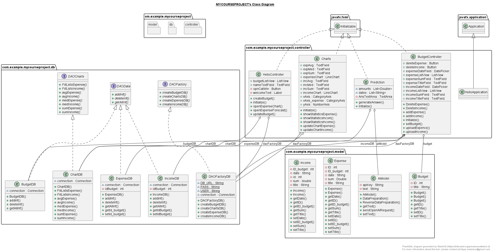
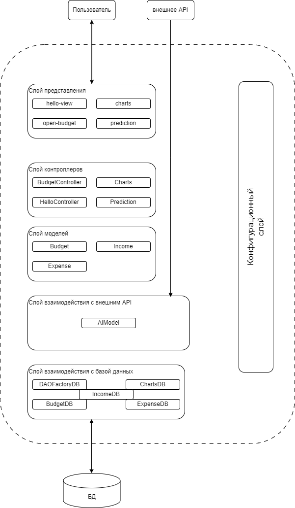

#Программа "Управление бюджетом"

##Описание

Программа "Управление бюджетом"   обладает функциями учета, планирования и контроля финансов, оптимизации и прогнозирования расходов. Пользователь может создавать бюджеты и конкретные категории расходов и доходов для каждого бюджета. Также пользователь может визуализировать данные в виде графиков, выводить статистику и прогнозировать будущие расходы. 

##Диаграмма классов программы

##Архитектура
В качестве архитектуры приложения был выбран архитектурный стиль МVC (model-view-control). Основная цель применения MVC состоит в разделении данных и бизнес-логики от визуализации. За счет такого разделе-ния повышается возможность повторного использования программного кода: например, добавить представление данных какого-либо существующего марш-рута не только в виде HTML, но и в форматах JSON, XML, PDF, XLSX стано-вится очень просто и не требует исменений слоя бизнес-логики исходного маршрута. Также упрощается и сопровождение программного кода: внесение изменений во внешний вид, например, не отражаются на бизнес-логике, а изменения бизнес-логики не затрагивают визуализацию.
Концепция MVC разделяет данные, представление и обработку действий пользователя на компоненты:
* Модель / Model — предоставляет собой объектную модель некой пред-метной области, включает в себя данные и методы работы с этими дан-ными, реагирует на запросы из контроллера, возвращая данные и/или из-меняя своё состояние. При этом модель не содержит в себе информации о способах визуализации данных или форматах их представления, а также не взаимодействует с пользователем напрямую. В реализуемом программном продукте в качестве модели представлены классы:
    * Budget – представляет собой сущность Budget;
    * Expense – представляет собой сущность Expense;
    * Income – представляет собой сущность Income.
* Представление / View — отвечает за отображение информации (визуали-зацию). Одни и те же данные могут представляться различными спосо-бами и в различных форматах. Например, коллекцию объектов при помощи разных представлений можно представить на уровне поль-зовательского интерфейса как в табличном виде, так и списком; на уровне API можно экспортировать данные как в JSON, так в XML или XSLX. В качестве View компонентов в данном продукте представле-ны fxml компоненты:
  * hello-view – представляет интерфейс главного окна с меню и отобра-жением списка бюжетов;
  * open-budget – представляет интерфейс окна с раcширенной информа-цией о бюджете;
  * charts – представляет интерфейс окна отображение графиков и стати-стической информации;
  * prediction –  представляет интерфейс окна отображения прогнозируе-мой информации.
  * Контроллер / Controller — обеспечивает связь между пользователем и системой, использует модель и представление для реализации необхо-димой реакции на действия пользователя. Как правило, на уровне кон-троллера осуществляется фильтрация полученных данных и авторизация — проверяются права пользователя на выполнение действий или получение информации [2]. В качестве котроллеров в данном про-граммном продукте представлены:
  * HelloController – реализует взаимодействие с окном, представленным компонентом hello-view.fxml;
  * BudgetController – реализует взаимодействие с окном, представленным компонентом open-budget.fxml;
  * Charts – реализует взаимодействие взаимодействие с окном, представ-ленным компонентом charts.fxml;
  * Prediction – реализует взамодействие с окном, представленным компо-нентом prediction.fxml.
  Также стоит выделить компоненты, которые нельзя точно отнести к Model. Они имеют роль взаимодействия с базой данных и внешним API, то есть выполняя бизнес логику. К ним можно отнести классы:
* AIModel – взаимодействует с внешним API.
* DAOFactoryDB, ChartDB, BudgetDB, ExpenseDB, IncomeDB – взаимо-действуют с базой данных, обрабатывают получаемые данные.

##Использованные паттерны
В ходе создания программного продукта были использованы паттерны Фабрика и DAO. Они объедены в стратегию Factory for DAO (фабрика для DAO). Изначально, возникла потребность в использовании базы данных в про-граммном продукте. Для реализации логики было решено использовать паттерн DAO. DAO реализует необходимый для работы с источником данных механизм доступа.   Использующие DAO бизнес-компоненты работают с более простым интерфейсом, предоставляемым объектом DAO своим клиентам. DAO полно-стью скрывает детали реализации источника данных от клиентов. Поскольку при изменениях реализации источника данных представляемый DAO интерфейс не изменяется, этот паттерн дает возможность DAO принимать различные схе-мы хранилищ без влияния на клиенты или бизнес-компоненты. По существу, DAO выполняет функцию адаптера между компонентом и источником данных [4]. Это вариант удобен для использования в концепции MVC потому, что поз-воляет убрать логику работы с базой данных из контроллеров и объединить в одном месте. При определении интерфейсов DAO было выделено два интерфей-са, которые объединяют методы работы с базой данных. Один интерфейс опи-сывает стандартную логику с базой данных - простые запросы на добавление, удаление и получение информации.  Второй интерфейс требуется для работы с базой данных при сложных запросах – получение информации для графиков и статистических расчетов.
Фабрика позволяет достичь лучшей абстракции и гибкости. При добавле-нии новой логики для DAO достаточно всего лишь добавить создание объекта класса, реализующего интерфейс нового DAO, в интерфейс и класс, реализую-щий интерфейс Фабрики. Кроме того, в классе, реализующем интерфейс Фабри-ки, происходит подключение к базе данных, что объединяет логику работы с ба-зой данных. Фабрика позволяет генерировать объекты классов DAO разных ти-пов, что позволяет абстрагироваться от конкретных реализаций DAO, улучшает модульность и поддерживаемость кода.
Также для реализации возможности прогнозирования был реализовано взаимодействие с внешним API. В качестве API был использован OpenAI API представляет собой программный интерфейс, предоставляемый OpenAI, кото-рый позволяет разработчикам взаимодействовать с моделями и сервисами, раз-работанными OpenAI. Чтобы использовать OpenAI API, необходимо был полу-чен ключ доступа к API. В качестве модели для прогнозирования была выбрана "text-davinci-003". Модель "text-davinci-003" - это одна из моделей языка GPT-3.5 от OpenAI, которая является моделью глубокого обучения для генерации текста. Модель GPT-3.5 "text-davinci-003" обучена на большом объеме тексто-вых данных и способна генерировать связные и информативные ответы на раз-личные запросы и задачи.
В качестве библиотеки взаимодействия с API была выбрана Apache HttpComponents. Apache HttpComponents, также известный как HttpClient, явля-ется библиотекой для выполнения HTTP-запросов и обработки HTTP-ответов в языке программирования Java. Он предоставляет удобный и гибкий интерфейс для взаимодействия с веб-серверами.
